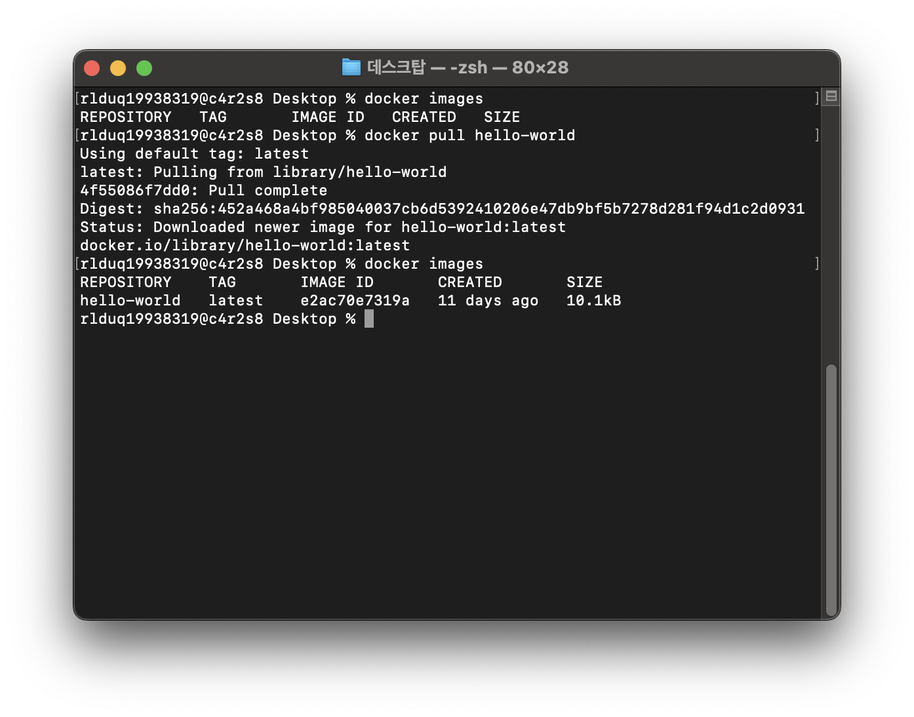
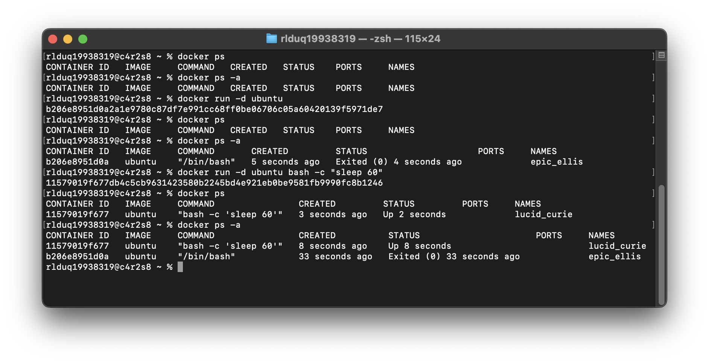

# DOCKER 기본 운영 명령 수행

## 1) 이미지 다운로드/목록 확인
`docker images`를 이용하여 설치된 docker image를 확인

`docker pull hello-world`을 이용해서 docker image를 다운로드

## 2) 컨테이너 실행/중지/목록 확인
`docker ps`로 실행 중인 docker 컨테이너 목록을 확인

`docker ps -a`를 사용하면 중지된 docker 컨테이너를 포함한 목록도 확인 가능

`docker start` 명령어로 기존에 중지된 docker 컨테이너를 직접 실행할 수 있음.

`docker stop` 명령어로 가동 중인 docker 컨테이너를 중지 가능

`docker rm` 명령어로 불용 컨테이너를 삭제(정리) 가능

## 3) 운영 로그 확인
`docker logs`로 로그를 확인

`docker stats`로 리소스 확인

## 4) 기록
`docker pull 이미지명` 도커 허브에서 이미지 파일을 다운로드

`docker run 이미지명` 이미지로 도커를 실행. 이미지가 없으면 자동으로 도커 허브에서 이미지를 찾아서 다운로드함. 컨테이터를 create하고 attach옵션으로 start해줌.

`docker logs 컨테이너명`는 컨테이너의 로그를 확인할 수 있음.

`docker stats`는 각 컨테이너가 사용 중인 리소스를 확인할수 있음.

CPU, MEM USAGE / LIMIT, MEMm NET I/O, BLOCK I/O, PIDS을 확인할수 있음
