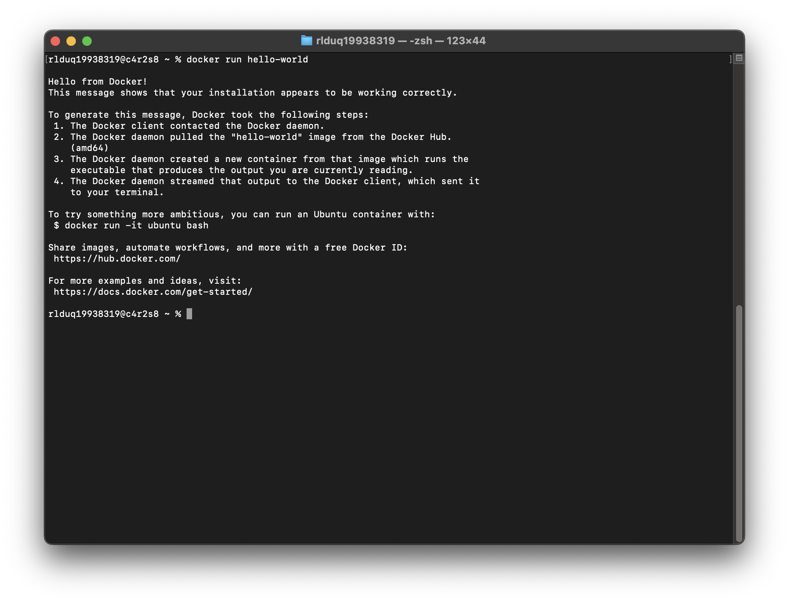
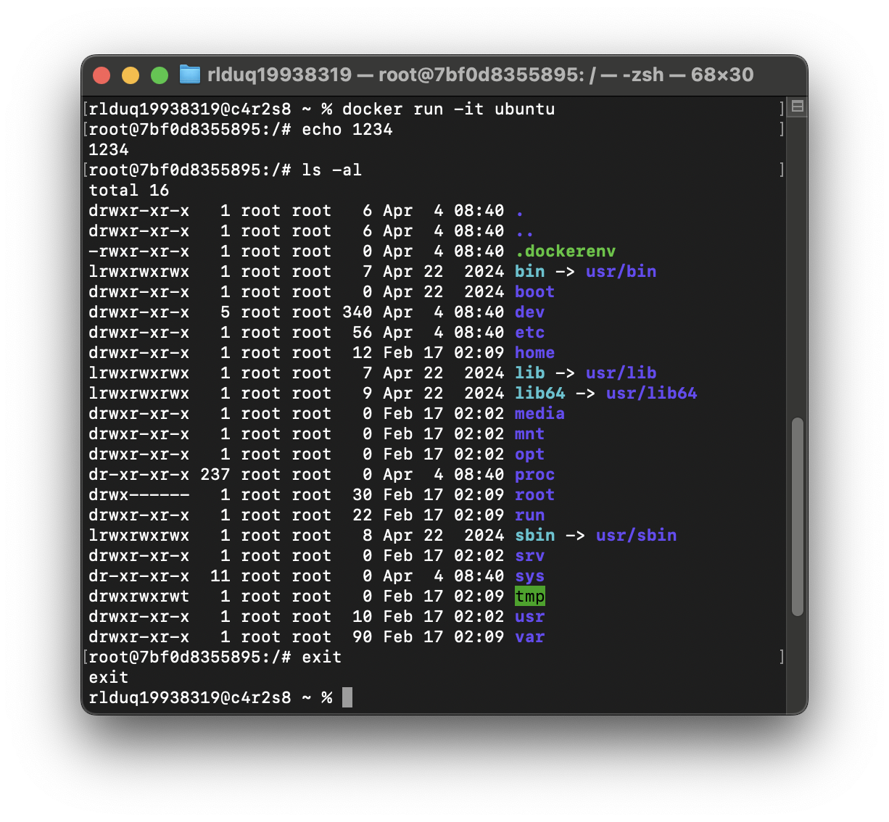

# DOCKER 컨테이너 실행 싫습

## 1) `hello-world` 실행 성공 기록


## 2) `ubuntu` 컨테이너를 실행하고 내부 진입 후 명렁어 실행
`ls` , `echo` 등의 간단한 명령 수행 결과


-it 인자를 사용해야지 우분투 터미널에 접속해서 명령어 사용 가능

## 3) 컨테이너 종료/유지(attach/exec 등)의 차이

### 컨테이너의 종료
`docker stop 컨테이너id`


### 컨테이너의 유지
`docker run -d nginx`를 실행하면 컨테이너가 백그라운드에 계속 유지되면서 프로세스를 실행했습니다.


아래 명령을 통해서 유지되고 있는 컨테이너에 기능 실행가능

`docker attach 컨테이너명`을 했을 때 이미 실행 중인 컨테이너에 연결되어서 해당 터미널에서 실시간 출력을 확인 할 수 있었습니다.


`docker exec -it 컨테이너명 명령어`을 했을 때 기존의 컨테이너에 해당 명령을 세로운 프로세스로 실행하고 출력을 확인할 수 있었습니다.


```docker run hello-world를 실행하면 1회성 실행으로 결과가 나오고 컨테이너가 종료되었습니다.```


## 4) 특정 컨테이너 삭제

특정 Docker 컨테이너를 삭제하려면 다음 명령어를 사용합니다:

- **중지된 컨테이너 삭제**: `docker rm 컨테이너이름`
  - 예: `docker rm mycontainer`

- **실행 중인 컨테이너 삭제**:
  - 먼저 중지 후 삭제: `docker stop 컨테이너이름 && docker rm 컨테이너이름`
  - 강제 삭제: `docker rm -f 컨테이너이름` (실행 중이라도 바로 삭제)


주의: 삭제된 컨테이너는 복구할 수 없으며, 연결된 볼륨의 데이터도 함께 삭제될 수 있습니다. 삭제 전 `docker ps -a`로 컨테이너 상태를 확인하세요.