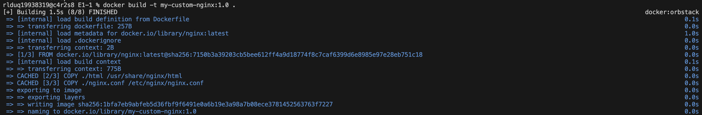
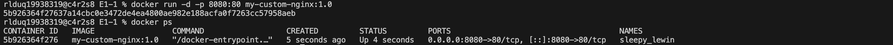
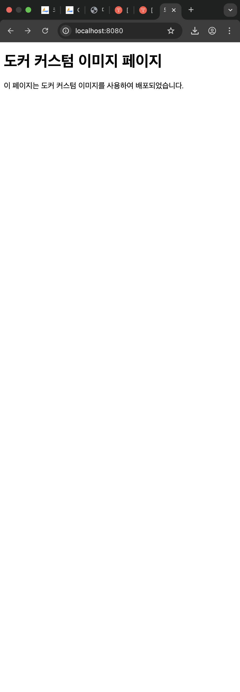

# DOCKER 커스텀 이미지

## 1) Dockerfile 이미지 기반 커스텀 이미지 생성


### 가) Dockerfile 작성
```
# 파일명: Dockerfile
FROM nginx:alpine

# 커스텀 포인트 1: 정적 콘텐츠 추가
COPY ./html /usr/share/nginx/html

# 커스텀 포인트 2: NGINX 설정 파일 교체
COPY ./nginx.conf /etc/nginx/nginx.conf

# 기본 실행 명령 (nginx는 이미 정의됨)
CMD ["nginx", "-g", "daemon off;"]
```


Nginx:Alpine을 베이스 이미지로 선택

커스텀 포인트로 웹 페이지 하나를 정적 콘첸츠로 추가

또 다른 커스텀 포인트로 설정을 다음과 같이 교체


nginx.conf
├── 1️⃣ 전역 설정 (Global context)
├── 2️⃣ events 블록
├── 3️⃣ http 블록
│   ├── 로깅 설정
│   ├── 성능 설정
│   └── server 블록 (실제 웹 서버 설정)

상기 엔진X의 설정파일 구조를 참고하여 

```
events {
    worker_connections  4096;
}
```

이벤트의 워커 콘넥션을 4096 으로 늘려서 접속 가능한 수를 늘려줌.


### 나) docker 이미지 빌드

`docker build -t my-custom-nginx:1.0 .`


docker buildx를 통한 build입니다.

사용한 인자 t는 이름 뒤에 태그를 붙이기 위한 인자로 상기에서는 버전 표기를 위해서 사용했습니다.


### 다) docker 컨테이너 실행
`docker run -d -p 8080:80 my-custom-nginx:1.0`


d 인자는 데몬(백그라운드) 실행으로 출력을 현재 터미널에서 띄우지 않는 옵션입니다.

p 인자는 포트 매핑으로 호스트로 들어오는 포트를 게스트 컨테이너로 연결해 변경해주는 옵션입니다.

### 라) docker 커스텀 컨테이너의 서비스(웹)
