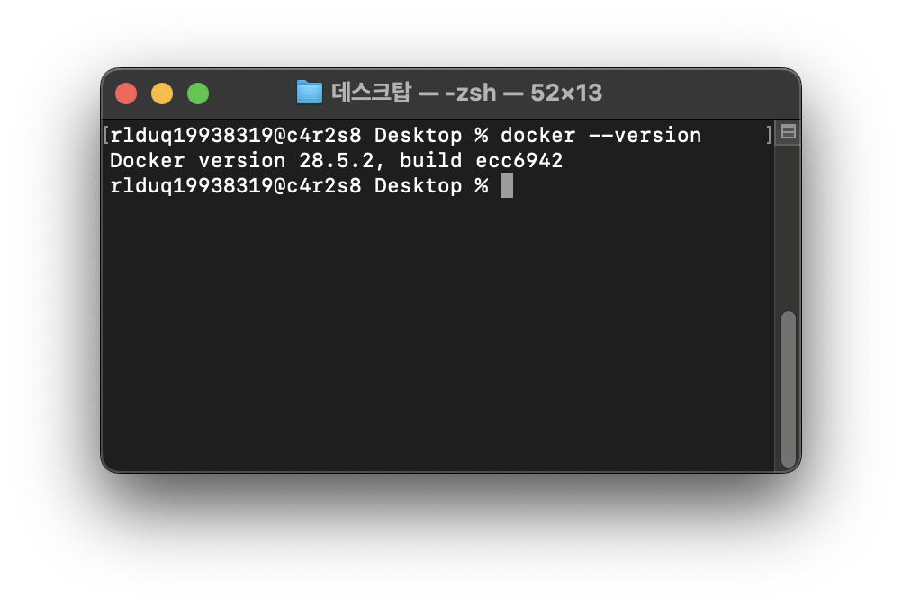
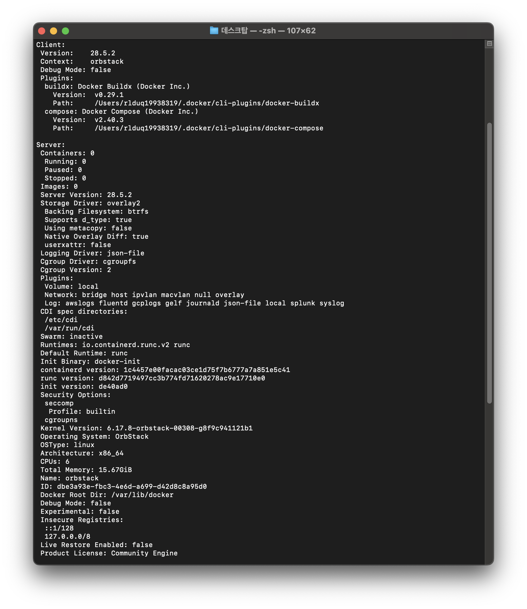
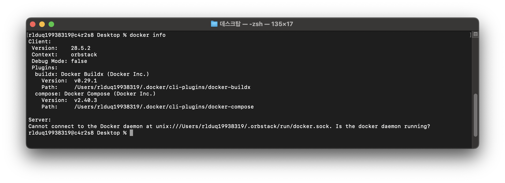

# DOCKER 설치 및 기본 점검

## 1) 도커 버전을 확인
`docker --version`을 이용해서 docker의 버전을 확인

## 2) 도커 데몬 동작 여부 확인
`docker info`를 사용하여 docker 데몬이 실행 중인지 확인

명령어를 사용하면 도커의 버전, 빌드의 버전, 컴포즈의 버전, 컨터에너의 갯수, 이미지의 갯수, 파일 시스템, 로깅 방식, 볼륨, 커널버전, 아키텍쳐, 네트워크 방식 등의 정보를 확인할수 있음.

도커가 동작중이 아닐때 문구

