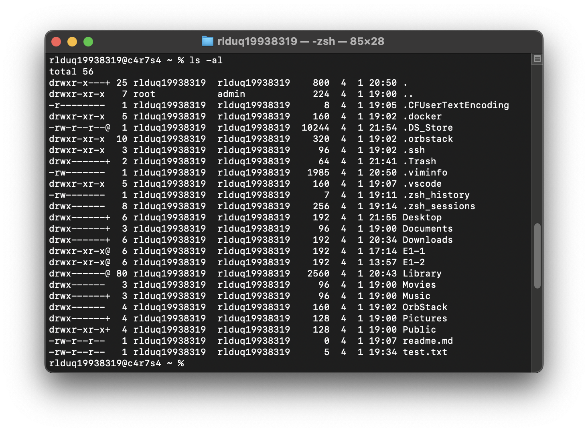
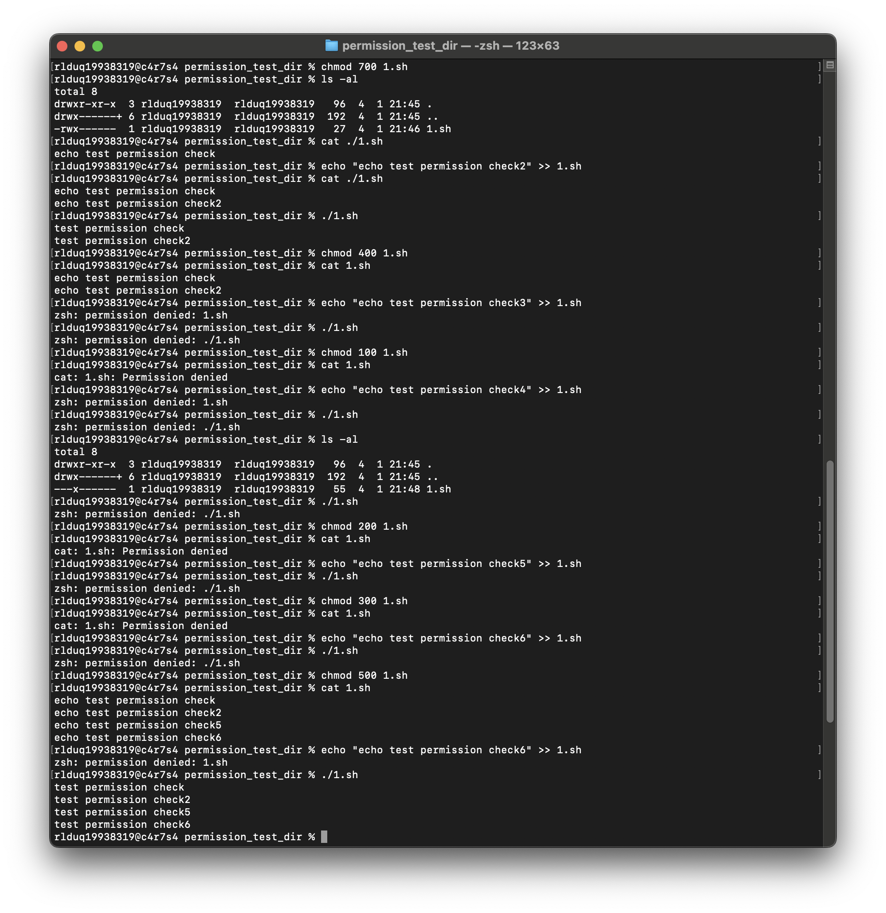
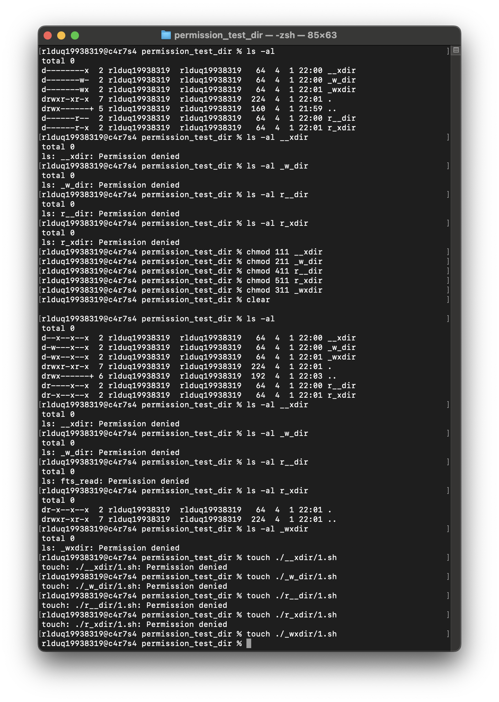

# 권한 실습 및 증거 기록

## 1) 파일의 권한을 확인하는 방법
ls -l

ls명령어에 -ㅣ 옵션을 사용하면 파일의 권한, 생성시간, 업데이트 시간, 소유권자, 용량 등이 나옴. 

여기서 제일 앞 drwx-rwx-rwx 형식의 표기가 권한으로 알파벳 중 일부가 _으로 나올 수 있고 _은 해당 권한이 없음을 의미

d는 디렉토리를 의미하고 _시 파일을 의미. r은 읽기 권한, w는 쓰기 권한, x는 실행 권한을 의미한다.

rwx가 3개인 이유는 순서대로 각각 소유권자, 소유권자 그룹, 다른 사용자을 의미하기 때문이다.

x:1, w:2, r:4 이므로 755로 권한을 주면 _rwx-r_x-r_x가 됩니다.

## 2) 파일의 권한 변경
파일의 권한을  chomod 700로 변경 후 읽기와 쓰기, 실행 확인

파일의 권한을 chomod 400로 변경 후 쓰기와 실행이 안됨을 확인

파일의 권한을 chmod 100로 변경후 읽기와 쓰기가 안됨을 확인

파일의 권한을 chmod 200로 변경 후 읽기와 실행이 안됨을 확인

파일의 권한을 chmod 300로 변경 후 쓰기는 되나 읽기가 안됨을 확인

파일의 권한을 chmod 500로 변경 후 읽기와 실행은 되나 쓰기가 안됨을 확인

## 3) 디렉토리의 권한 변경
디렉토리의 모든 권한은 x(1) 즉 실행 권한과 같이 있어야 동작됨.

r만 있는 경우 ls불가 r_x인 경우 ls 가능. 내부 파일에 권한이 있디면 실헹도 가능

w만 있는 경우 mv, rm, touch 등 불가. _wx인 경우 mv, rm, touch 가능

x만 있는 경우, 내부 파일 실행 가능. 없으면 cd도 불가능.

