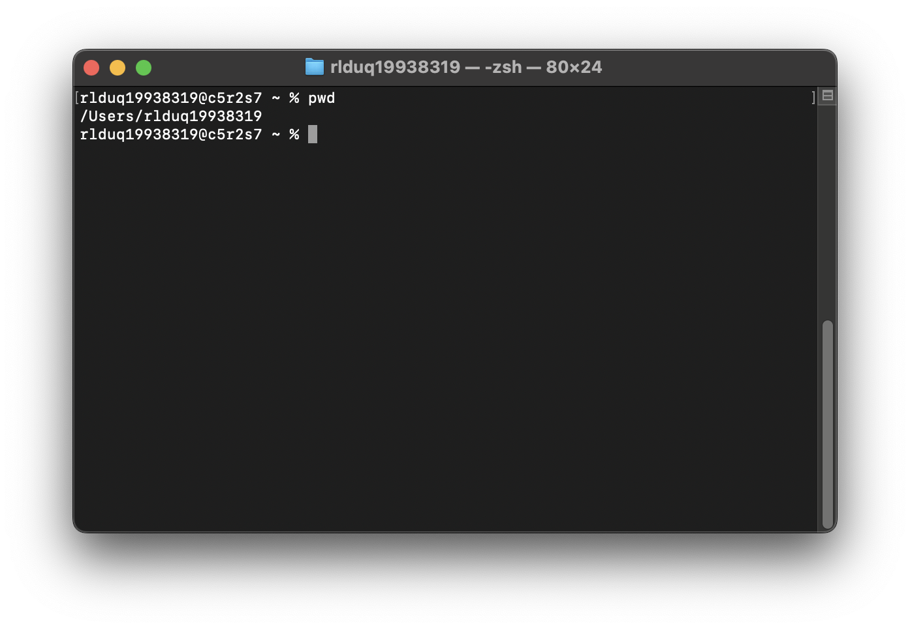
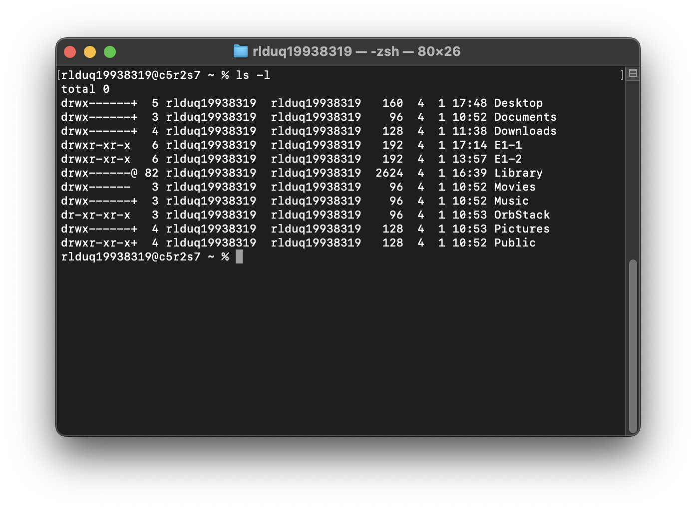
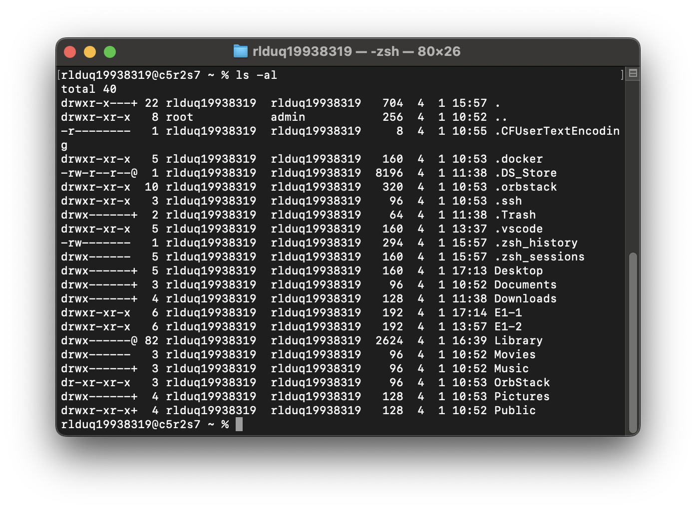
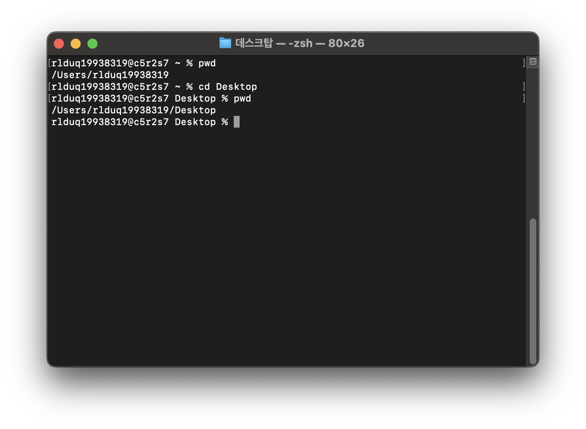
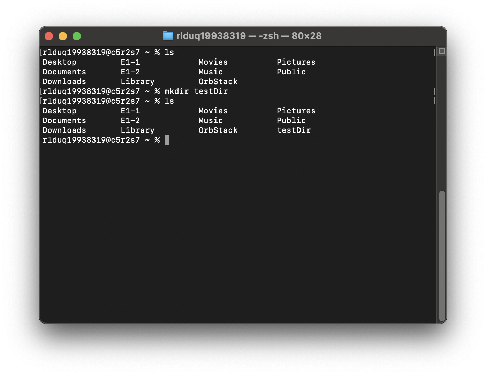
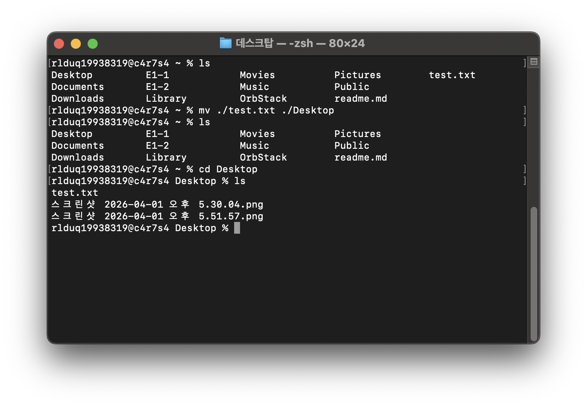
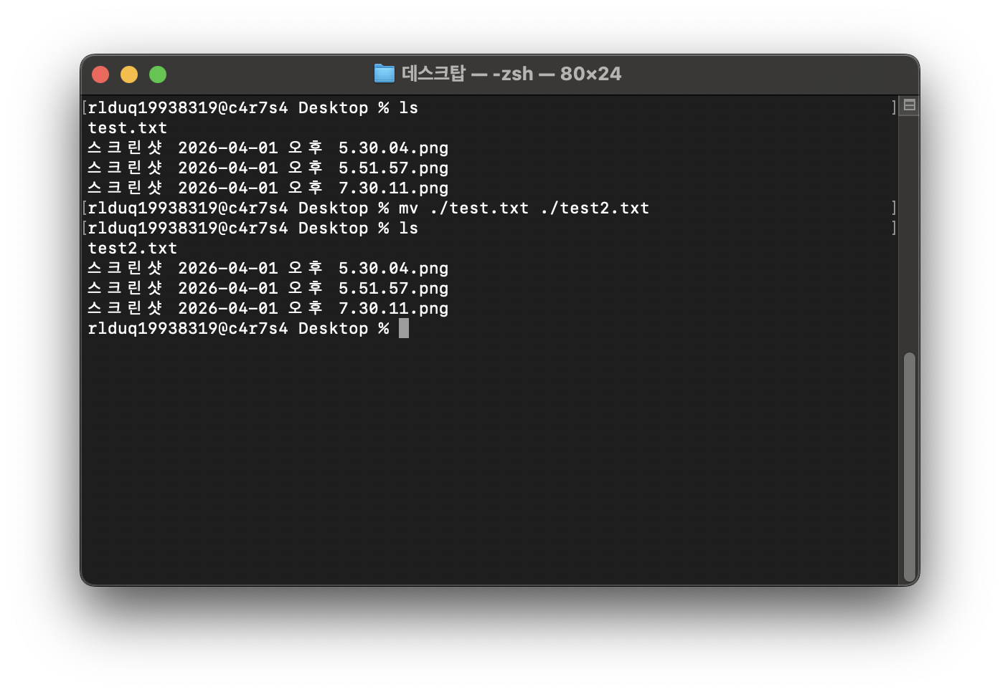
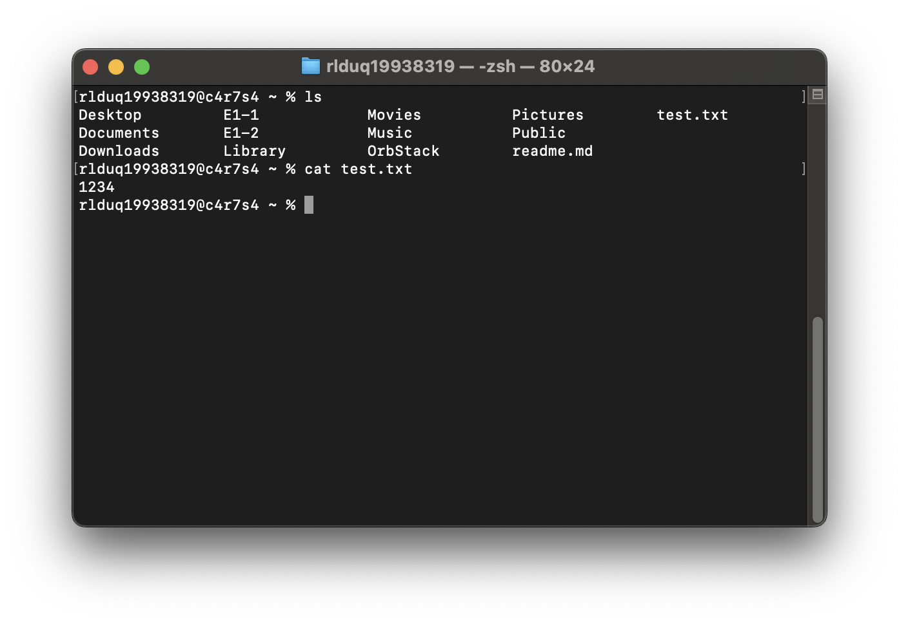
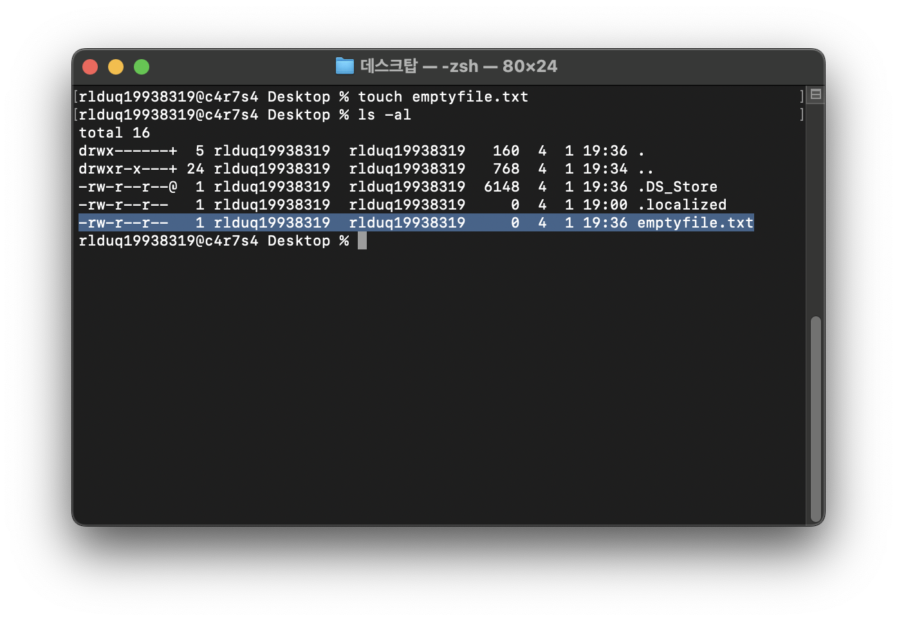

# 터미널 조작 로그

## 1) 현재 위치 확인
현재 디렉토리 위치(경로) 확인을 위해서 pwd 명령어 사용

## 2) 목록 확인
현재 디렉토리 내 하위 목록(디렉터리(폴더)와 파일)을 확인하기
ls 명령어 사용 -a 옵션을 사용하면 숨김 처리된 파일도 볼수 있음.
-al 옵션을 이용하면 상세한 목록으로 볼수 있음

ls -l과 ls -al을 각각 사용해서 숨김 파일이 보임을 확인

ls -l

ls -al

## 3) 디렉토리 이동
cd 명령어를 사용하여 디렉터리 이동

## 4) 생성
mkdir 명령어를 사용 하여 디렉토리 생성

## 5) 이동/이름 변경
mv 명령어를 이용하여 파일을 이동

mv 명령어를 이용하여 파일 이름을 변경

## 6) 파일 내용 확인
cat 명령어를 이용하여 파일의 내용을 확인

## 7) 빈 파일 생성
touch 명령어를 사용해서 빈 파일 생성
ls -al을 이용해서 파일의 용량을 확인하여 빈 파일임을 확인

